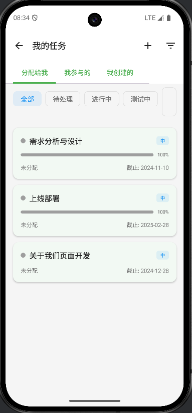

# Clan Management System

一个基于Android MVVM架构的团队管理系统应用。

## 项目概述

这是一个现代化的团队管理系统，采用Android MVVM架构模式开发，提供团队成员管理、角色故事经历、活动组织、任务处理等功能。

## 项目地址
[GITEE](https://gitee.com/ycWyx/clan-android)
[GITHUB](https://github.com/LiYiCha/Clan-Android)
## 技术架构

- **架构模式**: MVVM (Model-View-ViewModel)
- **开发语言**: Kotlin
- **UI框架**: Android原生 + Material Design + Compose
- **依赖注入**: Hilt/Dagger
- **网络请求**: Retrofit + OkHttp
- **数据存储**: Room数据库
- **异步处理**: Coroutines + Flow
- **构建工具**: Gradle

## 项目结构

```
clan-mvvm/
├── app/                          # 主应用模块
├── module-auth/                  # 用户认证模块
├── library-base/                 # 基础库模块
├── library-mvvmlazy/             # MVVM框架封装
├── library-home/                 # home模块
├── library-other/                # 其他模块（待开发）
├── config.gradle                 # 全局配置
├── build.gradle.kts              # 项目构建配置
├── module.build.gradle           # 公共模块构建配置
└── gradle/                       # Gradle配置
```

## 功能模块

### ✅ 已完成模块

#### 1. 用户认证模块 (module-auth)
- **登录功能**: 用户登录界面
- **界面截图**: 
  
  
  
  
  
- **技术特点**:
  - Material Design风格界面
  - TextInputLayout输入框
  - 响应式UI设计
  - 独立模块化管理

### 🚧 主要模块

#### 2. 用户信息模块 (module-user)
- **功能规划**:
  - 个人资料查看/编辑
  - 密码修改
  - 头像上传
- **API文档**: [MODULE_USER_API.md](docs/MODULE_USER_API.md)

#### 3. 团队管理模块 (module-sect)
- **功能规划**:
  - 团队列表展示
  - 团队切换
  - 团队统计数据
  - 首页仪表盘
- **API文档**: [MODULE_SECT_API.md](docs/MODULE_SECT_API.md)

#### 4. 任务管理模块 (module-task)
- **功能规划**:
  - 我的任务列表
  - 任务详情查看
  - 任务状态管理
  - 任务创建/编辑
- **API文档**: [MODULE_TASK_API.md](docs/MODULE_TASK_API.md)

#### 5. 文档管理模块 (module-document)
- **功能规划**:
  - 最近访问文档
  - 文档浏览器
  - Markdown/富文本渲染
- **API文档**: [MODULE_DOCUMENT_API.md](docs/MODULE_DOCUMENT_API.md)

#### 6. 消息通知模块 (module-message)
- **功能规划**:
  - 消息列表
  - 未读统计
  - 推送通知
- **API文档**: [MODULE_MESSAGE_API.md](docs/MODULE_MESSAGE_API.md)

## 📚 开发文档

| 文档 | 说明 |
|------|------|
| [API_DESIGN.md](docs/API_DESIGN.md) | API 总体设计规范 |
| [DEVELOPMENT_PLAN.md](docs/DEVELOPMENT_PLAN.md) | 开发计划与进度 |
| [MODULE_AUTH_API.md](docs/MODULE_AUTH_API.md) | 认证模块 API 详细文档 |
| [MODULE_USER_API.md](docs/MODULE_USER_API.md) | 用户模块 API 详细文档 |
| [MODULE_SECT_API.md](docs/MODULE_SECT_API.md) | 团队模块 API 详细文档 |
| [MODULE_TASK_API.md](docs/MODULE_TASK_API.md) | 任务模块 API 详细文档 |
| [MODULE_DOCUMENT_API.md](docs/MODULE_DOCUMENT_API.md) | 文档模块 API 详细文档 |
| [MODULE_MESSAGE_API.md](docs/MODULE_MESSAGE_API.md) | 消息模块 API 详细文档 |

## 开发环境

- **Android Studio**: Arctic Fox 或更高版本
- **最低API级别**: 21 (Android 5.0)
- **目标API级别**: 34 (Android 14)
- **Kotlin版本**: 1.8+

## 快速开始

1. **克隆项目**
   ```bash
   git clone [项目地址]
   cd clan-mvvm
   ```

2. **配置开发环境**
   - 安装Android Studio
   - 配置Android SDK
   - 安装必要的插件

3. **构建项目**
   ```bash
   ./gradlew build
   ```

4. **运行应用**
   - 连接Android设备或启动模拟器
   - 在Android Studio中点击运行按钮

## 模块依赖

```
app/
├── library-base/          # 基础库
├── library-mvvmlazy/      # MVVM框架
└── module-auth/           # 认证模块

module-auth/
├── library-base/          # 基础库
└── library-mvvmlazy/      # MVVM框架
```

## 主题配置

- **基础主题**: AppCompat主题
- **登录模块**: Material Design主题 (独立配置)
- **颜色方案**: 蓝色主色调 (#2D6BF5)

## 贡献指南

1. Fork本项目
2. 创建功能分支 (`git checkout -b feature/AmazingFeature`)
3. 提交更改 (`git commit -m 'Add some AmazingFeature'`)
4. 推送到分支 (`git push origin feature/AmazingFeature`)
5. 创建Pull Request

## 许可证

此项目采用MIT许可证 - 详情请查看LICENSE文件

## 联系方式

- 项目维护者: 
- 邮箱: 
- 项目地址: 

---

**开发状态**: 打副本中 🚀
**最后更新**: $(date +%Y-%m-%d)